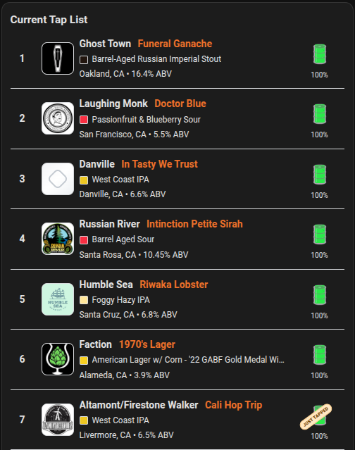

# Home Assistant DigitalPour

Custom Home Assistant integration that scrapes the DigitalPour Facebook menu interface and creates sensors for the tap data. Built-in Lovelace card is provided.

## Install
### HACS (Manual Custom Repository)
1. Open HACS.
2. Go to the integrations section.
3. Open the 3-dot menu and choose `Custom repositories`.
4. Add this repository URL.
5. Category: `Integration`.
6. Install `DigitalPour` from HACS.
7. Restart Home Assistant.

### Manual
1. Copy `custom_components/digitalpour` into your Home Assistant config directory.
2. Restart Home Assistant.

## Add to Home Assistant
[](https://my.home-assistant.io/redirect/config_flow_start/?domain=digitalpour)

## How to Setup
In Home Assistant:
1. Go to `Settings -> Devices & Services -> Add Integration -> DigitalPour`.
2. Enter:
   - `name` (user-defined; venue name is not available from this endpoint)
   - `company id`
   - `location id` (default is `1`)
   - scan interval

Get values from your menu URL, for example:

`https://fbpage.digitalpour.com/?companyID=53053a4dfb890c0fc05243f9&locationID=1`

Map URL values to config:
- `companyID` -> `53053a4dfb890c0fc05243f9`
- `locationID` -> `1`

## Sensors Created
- `sensor.<name>_tap_count`
- `sensor.<name>_just_tapped_count`
- `sensor.<name>_average_keg_level`
- `sensor.<name>_tap_list`
- `sensor.<name>_beverages`
- `sensor.<name>_producers`
- `sensor.<name>_just_tapped_taps`

`tap_list` attributes include:
- `taps` (list of objects)

`beverages` sensor attributes include:
- `beverages` (list of beverage names)

`producers` sensor attributes include:
- `producers` (unique producer names)

`just_tapped_taps` sensor attributes include:
- `just_tapped_taps` (list of tap numbers currently marked just tapped)

Each tap object includes:
- `tap_number`
- `producer`
- `beverage`
- `beverage_style`
- `beverage_color`
- `location`
- `abv`
- `just_tapped`
- `keg_level_percent`
- `keg_level_color`
- `logo_url`

## Built-in Lovelace Card
This integration ships its own card (`custom:digitalpour-card`).

- Card JS lives at `custom_components/digitalpour/www/digitalpour-card.js`.
- On setup, it is copied to `/config/www/digitalpour/digitalpour-card.js`.
- The integration auto-registers `/local/digitalpour/digitalpour-card.js` as a Lovelace module resource.

If needed, run service:
- `digitalpour.register_card_resources`

### Lovelace YAML Configuration
Add the card to a dashboard with YAML like:

```yaml
type: custom:digitalpour-card
entity: sensor.my_bar_tap_list
title: Current Tap List
show_title: true
show_tap_number: true
show_logos: true
show_style: true
show_details: true
show_keg: true
show_just_tapped: true
show_level_percent: true
max_rows: 20
```

#### Configuration options

| Option | Required | Default | Description |
|---|---|---|---|
| `type` | Yes | N/A | Must be `custom:digitalpour-card` |
| `entity` | Yes | N/A | `tap_list` sensor entity (for example `sensor.my_bar_tap_list`) |
| `title` | No | `Current Tap List` | Card header text |
| `show_title` | No | `true` | Show card title |
| `show_tap_number` | No | `true` | Show tap numbers |
| `show_logos` | No | `true` | Show producer logos |
| `show_style` | No | `true` | Show beverage style |
| `show_details` | No | `true` | Show detail line (location/ABV) |
| `show_keg` | No | `true` | Show keg level bar |
| `show_just_tapped` | No | `true` | Show `Just Tapped` badge |
| `show_level_percent` | No | `true` | Show keg level percent label |
| `max_rows` | No | N/A | Maximum number of taps shown |

### Card Screenshot


## Notes
- Data source is the DigitalPour Facebook menu interface (`fbpage.digitalpour.com`).
- Keg level is estimated from the visual height field in the HTML (`div.kegLevel`).
- If no taps are parsed, verify `companyID` and `locationID` from the menu URL.
- Venue/company name cannot be fetched from this interface; `name` must be user-provided.
